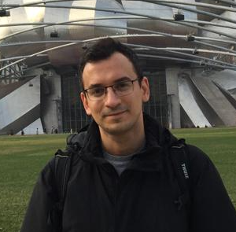

<!-- Global site tag (gtag.js) - Google Analytics -->
<script async src="https://www.googletagmanager.com/gtag/js?id=UA-166011945-1"></script>
<script>
  window.dataLayer = window.dataLayer || [];
  function gtag(){dataLayer.push(arguments);}
  gtag('js', new Date());

  gtag('config', 'UA-166011945-1');
</script>


<br>

<style>
body {
text-align: justify}
</style>
```{r setup, include=FALSE}
knitr::opts_chunk$set(echo = TRUE)
```
<div style= "float:right;position: relative; top: -75px;">

</div>

<p style="color:black"><p style="color:black">I received my Ph.D. from Koç University (in Istanbul, Turkey) in November 2020. I held a predoctoral fellowship (2019-2020) at the University of Illinois at Urbana-Champaign in the Department of Political Science. Political behavior and psychology, survey research, experimental analysis, and text-as-data methods are my main areas of expertise. I have practical experiences in various advanced quantitative research methods, such as categorical data analysis, multilevel models, and structural equation modeling (SEM). I am proficient in both Stata and R and prefer the latter for open science purposes.</p>  


